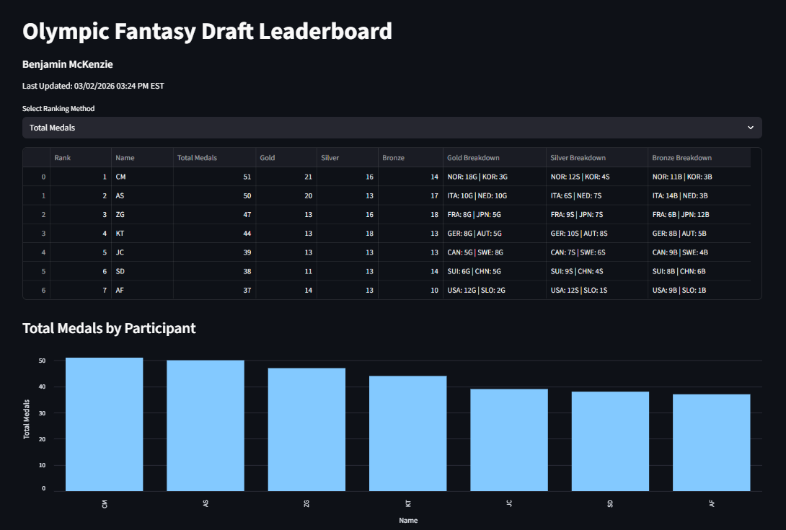
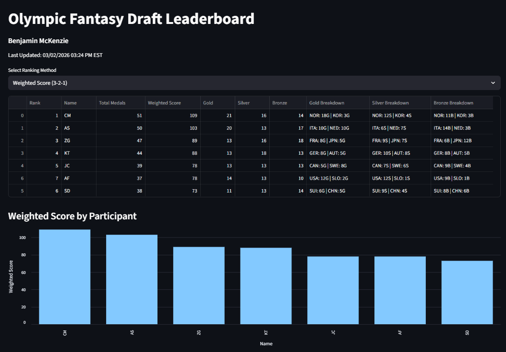

# 2026 Winter Olympics: Automated Fantasy Leaderboard

[View Live Leaderboard](https://milan2026fantasydraft-fzhufa7m5slxf7qfspmahk.streamlit.app/)
*(Deployed app may sleep during inactivity)

An ETL workflow that pulls live medal standings for the 2026 Winter Olympics, calculates fantasy scores and updates a Google Sheets leaderboard with a Streamlit dashboard for visualization.

*Note: The 2026 Winter Olympics have concluded. The leaderboard reflects final standings and is no longer updating.*

## Overview

This project automates scoring for a Winter Olympics fantasy draft. Medal standings are scraped from Wikipedia, cleaned and matched to drafted countries, ranked under different scoring rules, and pushed to a shared Google Sheet.

A Streamlit app reads from the sheet and displays a live leaderboard that refreshes automatically. 

Once deployed, the system runs on a schedule without manual updates.

## Dashboard Preview

### Total Medals View

### Weighted Score View

## Project Architecture 

### 1. Extract
- Uses `BeautifulSoup4` and `requests` to scrape the live medal table from Wikipedia.
- The parser isolates country rows and excludes headers and summary rows.
- Basic safeguards handle potential small changes in table structure. 
### 2. Transform
- Country names are standardized and mapped to IOC abbreviations.
- Medal counts are merged with participant draft picks.
- Two scoring methods:
  - Total Medals
  - Weighted Score (3-2-1)
- The leaderboard is sorted based on the selected scoring method.
- Tie-breaking: Total Medals, followed by Weighted Score, then the total count of Gold medals to ensure a definitive ranking.
- A timestamp is added to show the last successful update.

### 3. Load
- Authenticates using a Google Cloud service account.
- Writes results to Google Sheets via `gspread`.
- Credentials are stored securely using GitHub Secrets.
- Scheduled hourly with GitHub Actions (`cron`).
- Timezone automatically converts from UTC to EST.

## Streamlit Dashboard

The Streamlit app serves as the visualization layer:

- Authenticates to Google Sheets using `st.secrets`
- Auto-refreshes every 5 minutes
- Allows users to toggle between Total Medals and Weighted Score
- Displays:
  - An interactive leaderboard table
  - A bar chart built with Altair
- Includes error handling for authentication and data retrieval failures

The scraping script, scheduled job, and dashboard are separated, keeping data collection and visualization independent.

## Tech Stack

- Python 3.13  
- pandas  
- requests / BeautifulSoup4  
- gspread (Google Sheets API)  
- Streamlit + Altair  
- GitHub Actions (scheduled automation)

## Setup

1. Clone the repo
2. Install dependencies: `pip install -r requirements.txt` (or open in Codespaces / VS Code with `.devcontainer`, runs automatically)
3. Create Google Sheet named `Olympic_Fantasy_Draft_2026` and share it with your Google Service Account email as an Editor
4. Add Service Account JSON key as `GCP_CREDS` to both GitHub Secrets (for the scraper) and Streamlit Secrets (for the dashboard)
5. Run locally: `streamlit run dashboard.py` (requires `.streamlit/secrets.toml` with `GCP_CREDS`)

## Future Improvements

- Add historical tracking. Instead of clearing the sheet on each run, save snapshots of the leaderboard to a separate sheet, and add a line chart to Streamlit dashboard showing how ranks shifted throughout the Games.
- Set up notifications. Push an automatic update to a groupchat when the leaderboard changes, so participants don't have to check the dashboard manually.
- Improve visualizations. Create a Medal Breakdown stacked bar chart for each participant, showing the proportion of Gold, Silver, and Bronze medals contributing to their total.

